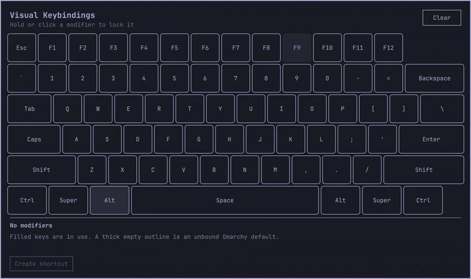

# Visual Keybindings

Explore and manage Omarchy shortcuts on an interactive keyboard.
Select or hold modifier keys to see used and available combinations.

[](docs/demo.mp4)

[Watch the video](docs/demo.mp4) · [Screenshot](preview.png)

> [!NOTE]
> Early preview. Review commands before saving shortcuts.

## Features

- US ANSI keyboard with clickable and physical modifier selection
- Shortcut descriptions, availability, and default/user origin
- Create, edit, remove, and restore shortcuts
- Automatic backups and rollback if Hyprland rejects a change
- Omarchy theme integration and refresh on open

## Requirements

- Omarchy 4.0+ with Omarchy Shell and Lua-based Hyprland configuration
  (`hyprctl eval` support required)
- Python 3 (standard library only)
- Git

## Install

```bash
omarchy plugin add https://github.com/dai199/omarchy-visual-keybindings.git --enable
```

## Usage

Open the overlay:

```bash
omarchy-shell shell toggle dai199.visual-keybindings
```

You can bind that command in `~/.config/hypr/bindings.lua`:

```lua
o.bind(
  "SUPER + SHIFT + K",
  "Visual Keybindings",
  "omarchy-shell shell toggle dai199.visual-keybindings"
)
```

Click modifiers to lock them, or hold the physical keys, then select a key:

- **Used key:** inspect, edit, or remove its shortcut.
- **Available key:** select **Create shortcut**, enter a description and
  command, review the Lua preview, and select **Save**.
- **Disabled default:** select **Restore** to re-enable it.

Normal desktop shortcuts are paused while the overlay captures input.
Close it with `SUPER + SHIFT + K`. See [Input layers](docs/input-layers.md)
to customize the close shortcut or capture behavior.

## Configuration and permissions

The plugin reads your shortcuts and updates `~/.config/hypr/bindings.lua`
when you save, remove, or restore a binding. Each change creates a
`bindings.lua.bak.*` backup, reloads Hyprland, and rolls back if validation
fails. Saved commands run when you use the shortcut, not when you save it.

Keyboard capture uses a runtime Hyprland submap without changing config
files. No root access, extra package installation, or network requests are
required by the plugin.

## Uninstall

Close the overlay, then run:

```bash
omarchy plugin remove dai199.visual-keybindings
```

Preserve local plugin changes before confirming removal. Remove any launcher
binding, menu entry, or custom capture configuration you added for the plugin.
Created shortcuts and `bindings.lua.bak.*` backups remain in your Hyprland
configuration; remove them separately if no longer needed.

## Limitations

- US ANSI layout only; JIS is planned.
- XKB options and IMEs may affect physical key mapping. Use on-screen
  modifiers if needed.
- Editing supports recognized `o.bind(...)` and `hl.unbind(...)` forms;
  computed Lua bindings may require manual editing.

## Development

Clone into the user plugin directory for automatic reload during development:

```bash
git clone https://github.com/dai199/omarchy-visual-keybindings.git ~/.config/omarchy/plugins/dai199.visual-keybindings
cd ~/.config/omarchy/plugins/dai199.visual-keybindings
omarchy plugin validate .
omarchy plugin enable dai199.visual-keybindings
```

Validate and run the helper tests:

```bash
omarchy plugin validate .
python3 -m unittest discover -s tests -v
```

See [Input layers](docs/input-layers.md) for keyboard capture details and
[Publishing](docs/publishing.md) for marketplace submission.

## License

[MIT](LICENSE)
